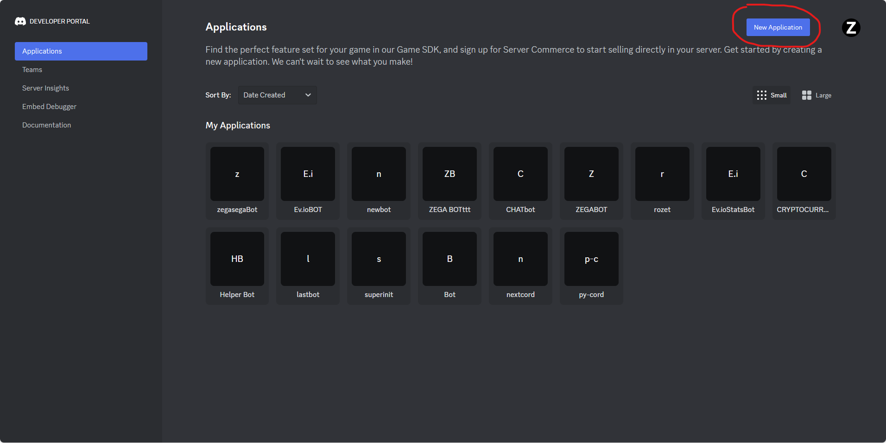
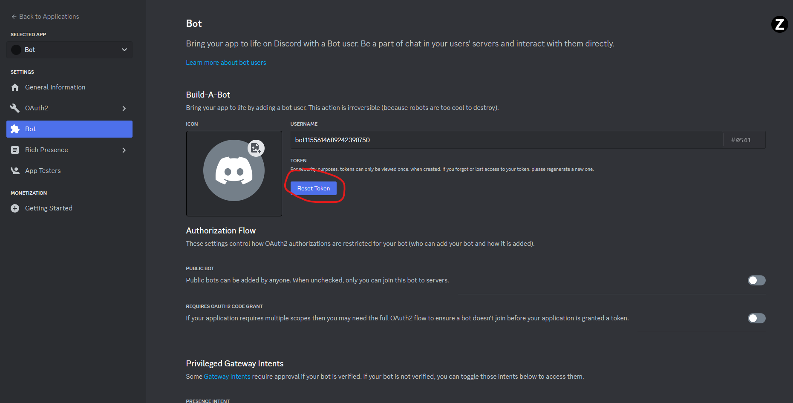
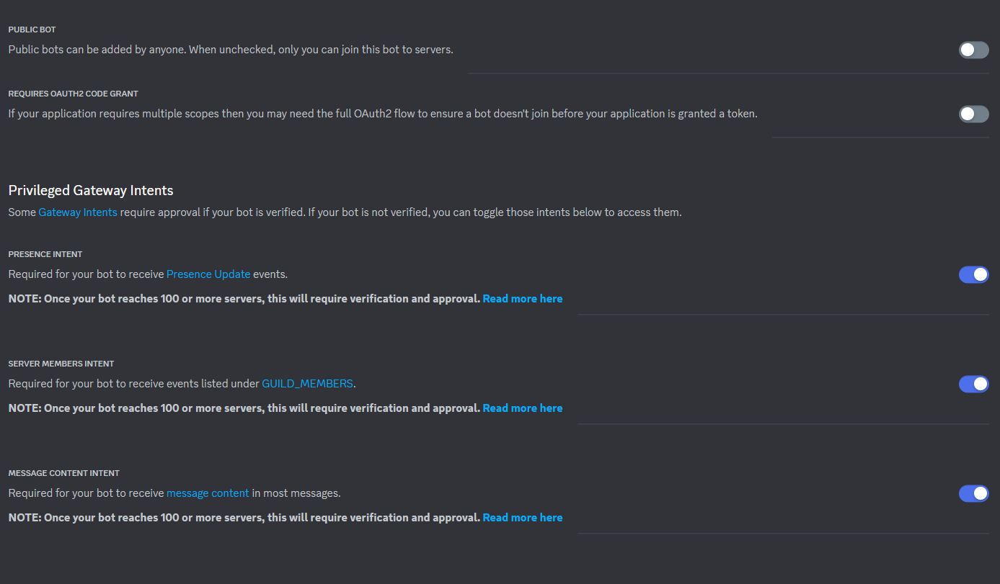

# Discord2023v
Discord Developments 2023 v\1.0.2

#   Discord2023v Bot Project

# Discord2023v Bot

This project contains a bot that operates on Discord, equipped with various commands and features.

## How to Use

To use the bot, you can follow these steps:

1. Clone this project:
2.Framework:py-cord


```bash
git clone https://github.com/zegasega/Discord2023v.git
```
```bash
pip install -r requirements.txt
```
```bash
change the discord token with yours:
DISCORD_TOKEN=YOUR_DISCORD_BOT_TOKEN
```

```bash
run the main file 
python main.py
python3 main.py
```

Feel free to use this English version of the README for your project. Make sure to replace `YOUR_DISCORD_BOT_TOKEN` with your actual Discord bot token, and adapt any other project-specific information as needed.





